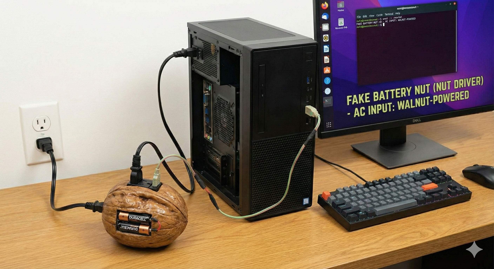

# fake-battery-nut

A Linux kernel module that bridges NUT (Network UPS Tools) to the desktop power stack, making any NUT-supported UPS appear as a laptop battery to your desktop environment.



### The Duality of Engineering

**Power delivery:**
```
Wall → 1350VA UPS → surge-only outlet → 450VA mini UPS → monitor
                  → battery outlet → gaming PC (93% load)
```
*"eh, the cords are beefy, it's probably fine"*

**Monitoring:**
```
UPS → USB HID → NUT daemon → upsc → bash script →
/dev/fake_battery_nut → custom kernel module →
/sys/class/power_supply/ → UPower → KDE
```
*"we need proper kernel-level integration for the data to show up correctly"*

One is an extension cord chain held together by vibes. The other is a DKMS-managed kernel module with systemd integration.

---

## The Problem

Linux has two parallel power management systems that don't talk to each other:

| System | Focus | Sees UPS? |
|--------|-------|-----------|
| **NUT** | Server/infrastructure, scripted shutdown | Yes (1382+ devices) |
| **UPower** | Desktop UI, suspend/hibernate | Only some USB HID devices |

When NUT claims your UPS (which it must, to manage it), UPower can't see it anymore. Your desktop has no idea a UPS exists - no battery icon, no low-power warnings, no auto-hibernate when the UPS battery gets critical.

## The Solution

This module creates a virtual battery in `/sys/class/power_supply/` that a daemon updates with NUT data:

```
Any NUT-supported UPS → daemon → kernel module → UPower → Desktop
```

Your computer now looks like a laptop to the desktop environment. KDE/GNOME see a battery that charges (on mains) and discharges (on UPS battery), and respond accordingly.

**This works with any of NUT's 1382+ supported devices** - serial, USB, SNMP, network-monitored, whatever. If NUT speaks to it, your desktop can now react to it.

## The Origin Story

This project was born when a gaming PC (Ryzen 9950X3D, RX 7900 XTX, 57" ultrawide) started tripping UPS overload alarms while running Minecraft with shaders. After plugging in a USB cable ignored for 4 years, we discovered the UPS was running at 123% capacity.

The fix? Move the monitor to a different UPS. $0 solution.

But then: "I want to see UPS stats in btop."

btop doesn't support NUT. So we wrote a kernel module.

Then we discovered UPower couldn't see the UPS either, because NUT had claimed it. So accidentally, we built the missing bridge between NUT and desktop power management.

## Components

- **fake_battery_nut.ko** - Kernel module creating BAT0 and AC0 in `/sys/class/power_supply/`
- **/dev/fake_battery_nut** - Control interface for updating values
- **nut-to-fakebattery** - Daemon that reads NUT and writes to the kernel module

## Installation

### From AUR (Arch Linux)

```bash
yay -S fake-battery-nut-dkms
```

### Manual Installation

```bash
# Build
make

# Install module
sudo make install

# Or use DKMS
sudo cp -r . /usr/src/fake-battery-nut-1.1.0
sudo dkms add fake-battery-nut/1.1.0
sudo dkms build fake-battery-nut/1.1.0
sudo dkms install fake-battery-nut/1.1.0

# Install daemon
sudo install -m755 nut-to-fakebattery.sh /usr/bin/nut-to-fakebattery
sudo install -m644 fake-battery-nut.service /etc/systemd/system/

# Enable
echo "fake_battery_nut" | sudo tee /etc/modules-load.d/fake-battery-nut.conf
sudo systemctl enable --now fake-battery-nut
```

## Configuration

Edit `/etc/systemd/system/fake-battery-nut.service` to set your UPS:

```ini
Environment=NUT_UPS=myups@localhost
```

## Control Interface

Write to `/dev/fake_battery_nut` to set values:

```bash
echo "capacity=100" | sudo tee /dev/fake_battery_nut    # Battery capacity %
echo "time=1800" | sudo tee /dev/fake_battery_nut       # Runtime in seconds
echo "voltage=24000000" | sudo tee /dev/fake_battery_nut # Voltage in µV
echo "temp=260" | sudo tee /dev/fake_battery_nut        # Temperature (tenths of °C)
echo "status=2" | sudo tee /dev/fake_battery_nut        # 0=discharge, 1=charge, 2=full
echo "charging=1" | sudo tee /dev/fake_battery_nut      # AC online status
```

## Data Mapping

| NUT Field | Control Command | power_supply Property |
|-----------|-----------------|----------------------|
| battery.charge | capacity | BAT0/capacity |
| battery.runtime | time | BAT0/time_to_empty_avg |
| battery.voltage | voltage | BAT0/voltage_now |
| ups.status (OL/OB) | status, charging | BAT0/status, AC0/online |
| (optional) | temp | BAT0/temp |

## Requirements

- Linux kernel headers
- NUT (nut package)
- bc (for voltage conversion in daemon)

## License

GPL v2 (same as original linux-fake-battery-module)

## Credits

Based on [linux-fake-battery-module](https://github.com/hoelzro/linux-fake-battery-module) by Rob Hoelz.

## See Also

- [ADR-001: Extended NUT Data Mapping](docs/architecture/001-extended-nut-data-mapping.md) - Architecture decisions and the UPower bridge discovery
